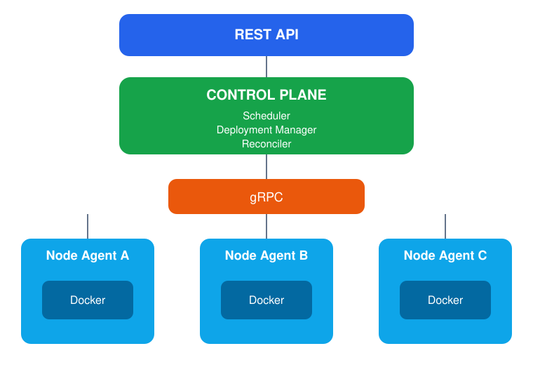

# Monarch

> Self-hosted Private Cloud Deployment Platform

**Monarch** is a self‑hosted, distributed deployment platform for personal infrastructure. It manages application deployments across one or more nodes running on your own hardware.

> ⚠️ **Status: Early Development** — This project is in its initial stages. APIs will change, features are missing, and contributions are very welcome!

---

## Vision
Monarch is designed around distributed systems principles such as desired state reconciliation, scheduling and automatic recovery. Monarch helps you:
- **Deploy** applications across your personal infrastructure
- **Orchestrate** services with minimal overhead
- **Maintain** applications in their desired state through health checks, reconciliation, and automatic recovery.

## Core Principles

- **Self-hosted first** — Monarch runs on infrastructure owned by the user.
- **API first** — every operation is exposed through an API before CLI or UI.
- **Desired state driven** — users declare the desired application state, Monarch reconciles the cluster.
- **Distributed by design** — multiple nodes are a first-class concept, even when running on a single machine during development.

### What Monarch is **NOT**

| ❌ Monarch is not | ✅ Monarch is |
|-------------|-----------|
| Kubernetes | A lightweight deployment platform for personal infrastructure |
| Commercial SaaS | Self-hosted software you install yourself |
| A DevOps tool | Developer-focused platform for personal infrastructure |
| Heroku | Runs on your own hardware, not in the cloud |

---

## Roadmap
| Epic | Result |
|-------|---------|
| E0 | Architecture|
| E1 | Control Plane API|
| E2 | Node Agent|
| E3 | Deployment Engine|
| E4 | Scheduler|
| E5 | Reconciler|
| E6 | Failure Recovery|
| E7 | Rolling Deployments|
| E8 | Observability|
| E9 | Networking|
| E10| GitHub Integration|
---
## Project Status

Current milestone: **E0 — Architecture**

Progress: `0 / 11` milestones completed.

### Milestones

- [ ] E0 Architecture
- [ ] E1. Control Plane API
- [ ] E2. Node Agent
- [ ] E3. Deployment Engine
- [ ] E4. Scheduler
- [ ] E5. Reconciler
- [ ] E6. Failure Recovery
- [ ] E7. Rolling Deployments
- [ ] E8. Observability
- [ ] E9. Networking
- [ ] E10. GitHub Integration

---

## Technology Stack

- **Language:** Go 1.25+
- **External API:** REST API (Control Plane)
- **Internal Communication:** gRPC (Control Plane ↔ Node Agent)
- **Storage:** PostgreSQL
- **Container Runtime:** Docker Engine

## Installation

Monarch is currently in the architecture phase.

Installation instructions will be available once the first MVP (Control Plane + Node Agent) is implemented.

## Documentation

Project documentation lives in `/docs`.

- [Vision](docs/01-vision.md)
- [Architecture](docs/02-architecture.md)
- [Domain Model](docs/03-domain-model.md)
- [REST API](docs/04-api.md)
- [gRPC Protocol](docs/05-grpc.md)
- [Architecture Decisions (ADRs)](docs/decisions)

## Contributing

We welcome contributions! Please read our [Contributing Guide](CONTRIBUTING.md) and [Code of Conduct](CODE_OF_CONDUCT.md) before getting started.

All types of contributions are encouraged — from bug reports and feature suggestions to code contributions and documentation improvements.

### Quick links
- [Contributing Guide](./CONTRIBUTING.md)
- [Code of Conduct](./CODE_OF_CONDUCT.md)
- [Issue Tracker](https://github.com/ecsxtazy/monarch/issues)

---

## License

Monarch is licensed under the MIT License.

See [LICENSE](LICENSE) for details.
